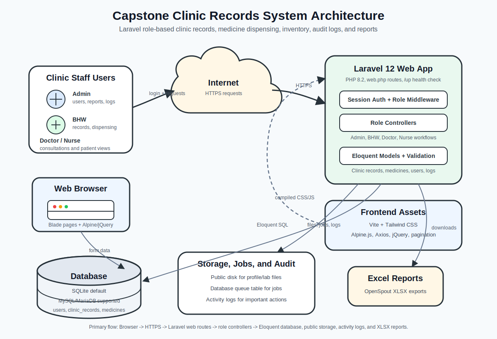
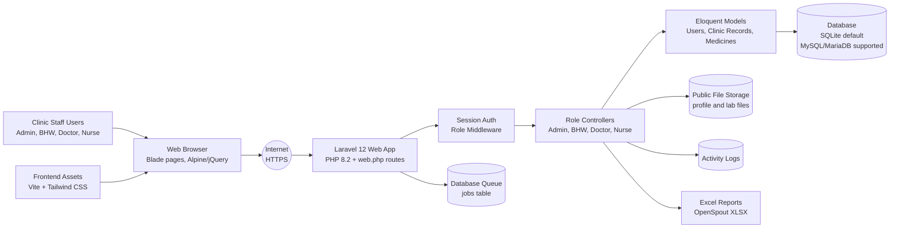

# Capstone System Architecture

This document describes the current architecture of the capstone clinic records system and provides a presentation-ready diagram similar to the supplied reference image.

## Architecture overview

The application is a Laravel web system for clinic staff workflows. Users access the system from a browser, authenticate through Laravel sessions, and are routed into role-specific areas for Admin, BHW, Doctor, and Nurse tasks. The backend persists clinic data through Eloquent models, stores uploaded files on Laravel's public disk, records activity logs, and exports reports as Excel files.

## Main components

| Area | Implementation |
| --- | --- |
| Browser UI | Blade views with Vite-built Tailwind CSS, Alpine.js, Axios, jQuery, and pagination scripts. |
| Routing | Laravel `routes/web.php` handles browser routes, dashboard redirects, profile updates, records, medicines, dispensing, reports, and role-specific route groups. |
| Authentication and authorization | Laravel session auth with `role` middleware registered in `bootstrap/app.php`. Admin, BHW, Doctor, and Nurse users are sent to their own dashboards and workflows. |
| Business workflows | Controllers in `app/Http/Controllers` and role folders implement clinic records, medicine dispensing, inventory ledger, user management, activity logs, dashboards, and reports. |
| Data persistence | Eloquent models persist users, clinic records, clinic record files, medicines, inventory logs, and activity logs. The default database connection is SQLite, with MySQL/MariaDB and other Laravel-supported drivers available through environment configuration. |
| File storage | Laravel's `public` disk stores user profile photos and clinic/laboratory files under `storage/app/public`, exposed through the `public/storage` symlink. |
| Background work | Laravel queue configuration defaults to the database queue driver, using the `jobs` table when asynchronous jobs are used. |
| Reports | OpenSpout generates XLSX exports for patient records, diagnosis, consultation, and medicine usage reports. |

## Primary request flow

1. A clinic staff member opens the system in a web browser.
2. Browser requests travel over HTTPS to the Laravel application.
3. Laravel session authentication verifies the user.
4. The `role` middleware allows the user into the correct Admin, BHW, Doctor, or Nurse route group.
5. Controllers validate input and execute the selected workflow.
6. Eloquent models read or write database records.
7. Uploaded files are saved to the public storage disk when required.
8. Important user actions are written to activity logs.
9. Report routes can return downloadable Excel files.

## Role-based workflows

- **Admin**: dashboard, user management, dispensing access, activity logs, inventory ledger, and admin reports.
- **BHW**: patient record intake, medicine dispensing, medicine management, and reports.
- **Doctor**: availability toggle, pending patient records, consultations, and patient record views.
- **Nurse**: dashboard, pending patient records, consultations, and patient record views.

See [`ROLE_STRUCTURE.md`](ROLE_STRUCTURE.md) for the code folder map by role.
