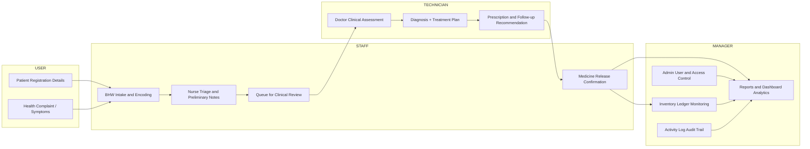

# System Structured Design (Capstone)

## 1) System Context

This capstone system is a **Role-Based Clinic Operating System** for Brgy. Banilad Health Center.  
It supports end-to-end consultation workflow from patient intake, clinical assessment, medicine dispensing, and management reporting.

## 2) Core Actors

- **Patient / Community User** (service receiver)
- **BHW (Barangay Health Worker)** - intake, registry prep, medicine release confirmation
- **Nurse** - triage and preliminary consultation support
- **Doctor** - diagnosis, treatment, follow-up plan
- **Admin / Manager** - user management, inventory oversight, activity monitoring, analytics

## 3) Major Functional Modules

1. **Authentication & Role Access**
   - Login/logout
   - Role-based dashboard redirection (`admin`, `bhw`, `nurse`, `doctor`)

2. **Patient Intake & Clinic Records**
   - Patient demographic and consultation capture
   - Visit history and printable records
   - Laboratory file attachments

3. **Clinical Assessment**
   - Nurse/Doctor review of pending records
   - Diagnosis and condition updates
   - Follow-up recommendations and consultation team traceability

4. **Medicine & Dispensing**
   - Medicine inventory (stock, batch, expiration)
   - Prescribed medicine queue
   - BHW/Admin dispensing with inventory deduction and release notes

5. **Reports & Analytics**
   - Patient and diagnosis reports
   - Consultation and medicine usage exports
   - Recovery and unresolved-case monitoring

6. **Administration & Governance**
   - User account/role management
   - Activity logs
   - Inventory ledger and operational dashboard

## 4) System Structured Diagram

```mermaid
flowchart TD
    A[Patient / Community User] --> B[BHW Intake]
    B --> C[Create Initial Clinic Record]
    C --> D{Clinical Review Path}

    D --> E[Nurse Assessment]
    D --> F[Doctor Consultation]
    E --> F

    F --> G[Diagnosis + Treatment Plan]
    G --> H[Medicine Prescription Queue]

    H --> I[BHW/Admin Dispensing]
    I --> J[Inventory Log Update]
    I --> K[Publish Consultation to Registry]

    K --> L[Clinic Records (Visible Registry)]
    L --> M[Reports & Export]
    L --> N[Recovery Monitoring]

    O[Admin / Manager] --> P[User Management]
    O --> Q[Activity Logs]
    O --> R[Inventory Ledger]
    O --> S[Dashboard Analytics]

    P --> S
    Q --> S
    R --> S
    M --> S
    N --> S
```

### Role-Column View (similar to sample format)



## 5) Role-to-Feature Structure

### USER (Patient-side)
- Receives consultation services
- Provides personal and health information during intake

### STAFF (BHW + Nurse)
- **BHW**
  - Register patient intake
  - Encode baseline consultation details
  - Release prescribed medicines and confirm registry publication
- **Nurse**
  - Review pending patient records
  - Assist consultation and clinical documentation

### TECHNICIAN (Doctor / Clinical Decision Role)
- Evaluate patient case and findings
- Encode final diagnosis and follow-up recommendation
- Provide medicine orders for dispensing queue

### MANAGER (Admin)
- Manage users and role permissions
- Monitor activity logs and audit trails
- Supervise inventory movement and stock health
- Generate reports and operational analytics

## 6) Data Backbone (Key Entities)

- `users`
- `clinic_records`
- `clinic_record_files`
- `medicines`
- `clinic_record_medicine` (pivot for prescribed medicine lines)
- `inventory_logs`
- `activity_logs`

---

This structure reflects the current system implementation and can be used directly in your capstone documentation chapter for **System Design / Structured Design**.
